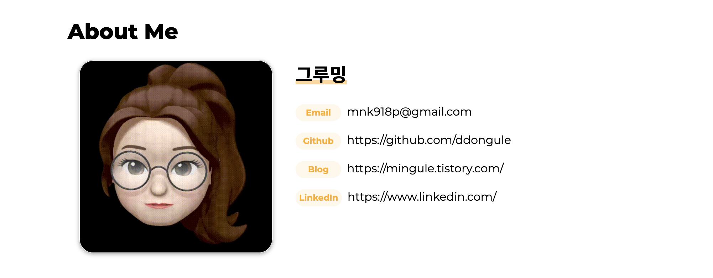
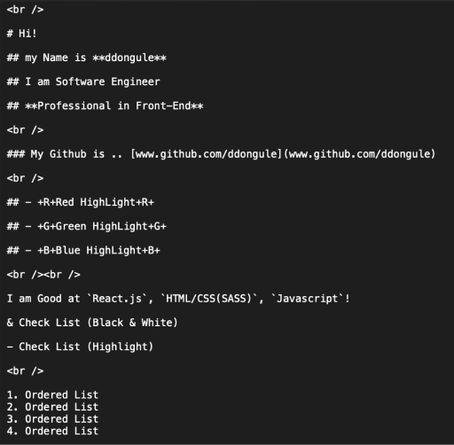
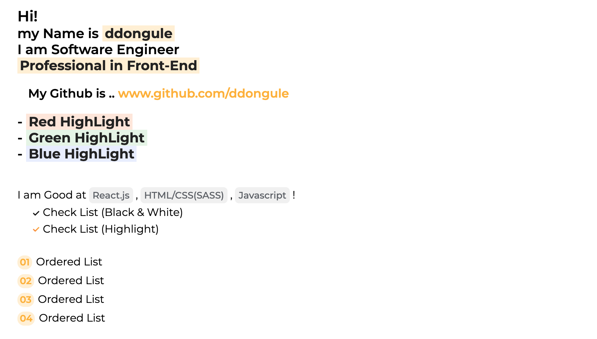
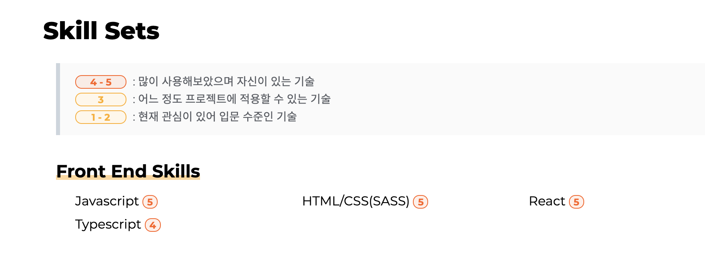
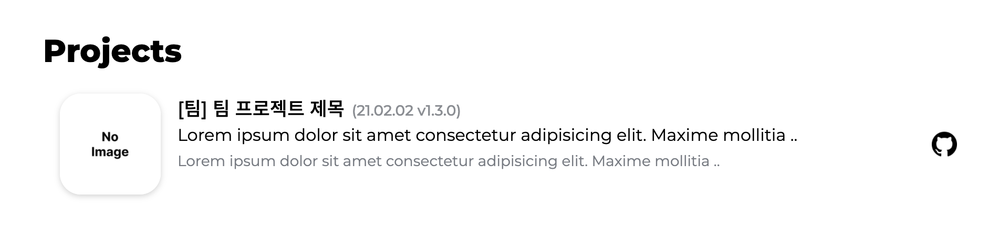
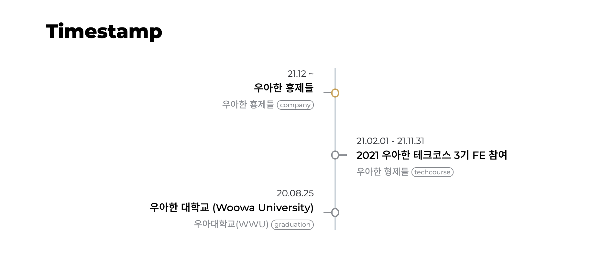
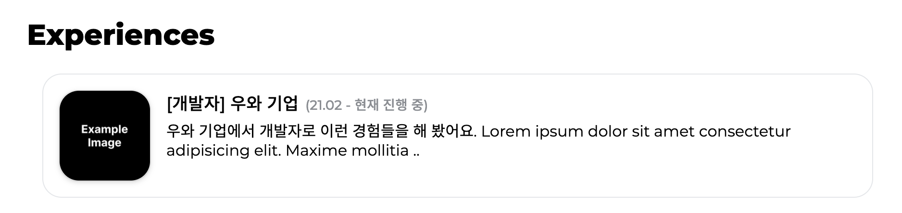
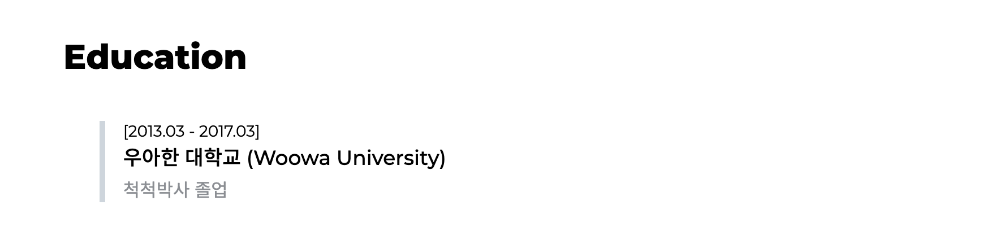

<div align="center">

</div>
<br />
<div align="center">
<a href=''>
  
  
 </a>
</div>

<div align="center">✨ 빠르고 쉽게 당신의 포트폴리오를 만들어보세요! ✨</div>
<br />

# 💫 ddongule-simple-portfolio

🌟 ddongule-simple-portfolio는 개발자를 위한 간단한 포트폴리오 템플릿입니다! 이 템플릿을 커스터마이징해 자신만의 포트폴리오를 만들어보세요! 코드를 보지 않아도 괜찮아요! `db.json`와 `이미지`, `마크다운`을 편집하면 끝나요!

## 💛 예시 보러가기 👉 ([ddongule's portfolio](https://www.ddongule.com))

## 🌿 기능

- 🔥 한 페이지에 모든 것을 담았어요!
- 🔥 반응형으로 만들어졌어요.
- 🔥 다크모드/라이트모드가 있어요!
- 🔥 다국어 지원(한국어/영어)

## 🪜 어떻게 사용하나요?

### 1. 이 레포지토리를 클론받으세요.

```
$ git clone https://github.com/ddongule/ddongule-simple-portfolio
```

### 2. 리포지토리 안에 들어가세요.

```
$ cd ddongule-simple-portfolio
```

### 3. 디펜던시를 다운받고, 서버를 시작하세요!

- NPM 사용

  ```
  $ npm install

  $ npm start
  ```

- Yarn 사용

  ```
    $ yarn

    $ yarn start
  ```

### 4. 🌎 포트폴리오를 만들러 떠나볼까요홍홍

## 🚀 빠르게 시작하기!

> 만약 아래의 내용 중 필요없으신 부분이 있다면 `db.json`에서 Section을 지워버리세요! 그래도 잘 돌아갈거에요!

- 예시)
  `db.json`에서 사용하고 싶은 Section만을 빼놓고 나머지를 지워보세요. 아래처럼요! `aboutMe`와 `timestamp`만 사용하고 싶으시다면, 이렇게 작성하시면 돼요!

  - `src/db.json`

    ```
      {
        "aboutMe": {
          "name": "그루밍",
          "nickName": "nickName!",
          "profileImg": "../assets/images/me.gif",
          "email": "mnk918p@gmail.com",
          "githubUrl": "https://github.com/ddongule",
          "blogUrl": "https://mingule.tistory.com/",
          "linkedInUrl": "https://www.linkedin.com/"
        },

        "timestamp": [
          {
            "title": "우아한 횽제들",
            "when": "21.12 ~ ",
            "organizer": "우아한 횽제들",
            "tags": ["company"]
          }
        ]
      }
    ```

### 🇰🇷🇺🇸 0. 기본 언어를 고르세요!

초기 언어는 **영어**로 선택되어 있습니다!

**🔥 한국어/영어 중 기본 언어를 고르실 수 있습니다.**

  

- `/src/db.json`로 가세요.

  #### 🇺🇸 [Default] 기본 언어를 영어로 세팅하기.

  ```
      "meta": {
        ...
        "defaultLanguage": "English"
        ...
      }
  ```

  #### 🇰🇷 기본 언어를 한국어로 세팅하기.

  > 아래 코드를 그대로 복사, 붙여넣기 하시면 됩니다! (대/소문자를 구별하기 때문에 오타가 생기면 동작하지 않을 수 있습니다.)

  ```
      "meta": {
        ...
        "defaultLanguage": "Korean"
        ...
      }
  ```

### 👉 1. Main Title Section.

  

- `/src/db.json`로 가세요.

  ```
      "aboutMe": {
        ...
        "nickName": "type your own title!"
        ...
      }
  ```

### 👉 2. About Me Section.

  

#### Main Image 바꾸기

1. `/public/assets/images`에 사용하실 이미지를 넣으세요.

   - `jpg`, `gif`, `png`

2. `/src/db.json`로 가세요.
   ```
     "aboutMe": {
       ...
       "profileImg": "../assets/images/yourImageFileName"
       ...
     }
   ```

#### Introduction Text 바꾸기

- `/src/assets/static/markdown/aboutMySelf.english.md`로 가세요.

  - (+) 한국어 버전을 사용하시려면, `aboutMySelf.korean.md`도 바꾸어 주셔야 합니다.

  > **Markdown으로 작성해보세요! 그럼 아래처럼 보일거에요!**

  

  > 결과는..?! 두근두근 세근네근 💛

  

  1. h1, h2, h3 사용하기

     ```
       # h1

       ## h2

       ### h3
     ```

  2. 하이라이트가 있는 굵은 글씨 사용하기

     - yellow

       ```
         **Hi, my name is ddongule**
       ```

     - red
       ```
         +R+Hi, my name is ddongule+R+
       ```
     - blue

       ```
         +B+Hi, my name is ddongule+B+
       ```

     - green
       ```
         +G+Hi, my name is ddongule+G+
       ```

  3. 엔터 치기

     ```
       <br />
     ```

  4. 코드블록 사용하기

     ```
       `React.js`
       `HTML/CSS(SASS)`
       `Javascript`
     ```

  5. 흑백 체크리스트 사용하기

     ```
       & Check List(Black & White)
     ```

  6. 색깔이 있는 체크리스트 사용하기

     ```
       - Check List(Black & White)
     ```

  7. 순서가 있는 리스트 사용하기

     ```
       1. Ordered List
       2. Ordered List
       3. Ordered List
       4. Ordered List
     ```

  8. 링크 삽입하기

     ```
       [보여줄 내용](https://www.your.link)
     ```

### 👉 3. Skill Sets Section.

  

자신있는 **Skill Sets** 들을 적어보세요!

> ✨ SkillSets Section을 커스터마이징 해봐요!

- `/src/db.json`에 가세요.

```

    "skillSets": [
      {
        "category": "Front End Skills",
        "skills": [
          { "skill": "Javascript", "level": "5" },
          ...
        ]
      },
      ...
    ]

```

### 👉 4. Projects Section.

  

**만들어보신 프로젝트**에 대해서 적어보세요!

> ✨ Projects Section을 커스터마이징 해봐요!

- `/src/db.json`에 가세요.

```

    "projects": [
      {
        "imgUrl": "/assets/images/exmaple.png",
        "githubUrl": "https://github.com/ddongule",
        "projectUrl": "www.ddongule.com",
        "title": "ddongule-simple-portfolio",
        "term": "21.02.02 v1.3.0",
        "description": "Lorem ipsum dolor sit amet consectetur adipisicing elit. Maxime mollitia ..",
        "attribution": "Lorem ipsum dolor sit amet consectetur adipisicing elit. Maxime mollitia ..",
        "tags": [] // Even if there are no tags to write, you should leave the empty array as is.
      },
      ...
    ]

```

### 👉 5. Timestamp Section.

  

**걸어온 길**에 대해서 하나씩 적어보세요!

> ✨ Timestamp Section을 커스터마이징 해봐요!

- `/src/db.json`에 가세요.

```

    "timestamp": [
      {
        "title": "Woowa Sisters",
        "when": "21.12 ~ ",
        "organizer": "Woowa Sisters",
        "tags": ["company"] // Even if there are no tags to write, you should leave the empty array as is.
      },
      ...
    ]

```

### 👉 6. Experiences Section.

  

어떤 **경험** 이 있으신지 적어보세요!

> ✨ Experiences Section을 커스터마이징 해봐요!

- `/src/db.json`에 가세요.

```

    "experiences": [
      {
        "imgUrl": "/assets/images/exmaple.png",
        "title": "[Software Engineer] Woowa Sisters Co.",
        "term": "21.02 - 현재 진행 중",
        "description": "Lorem ipsum dolor sit amet consectetur adipisicing elit. Maxime mollitia ..",
        "experienceUrl": "https://woowacourse.github.io/"
      },
      ...
    ]

```

### 👉 7. Education Section.

  

어떤 **교육**을 받으셨는지 적어보세요!

> ✨ Education Section을 커스터마이징 해봐요!!

- `/src/db.json`에 가세요.

```

    "educations": [
      {
        "title": "Woowa University",
        "term": "2013.03 - 2017.03",
        "description": "[Graduated] Computer Science and Engineering"
      },
      ...
    ]

```

## 🐞 버그를 찾으셨나요?

- [Issue에 등록해주세요!](https://github.com/ddongule/ddongule-simple-portfolio/issues)

## 이 레포지토리에 기여하고 싶으신가요?

1. **Fork** this repository
2. **Create** your own branch: `git checkout -b new-feature`
3. **Add** and **Commit**: `git commit -am 'feat: add new feature`
4. **Push** to your branch: `git push origin new-feature`
5. **Submit** a Pull Request!🌟

## License

- [`MIT License`]('./LICENSE')
